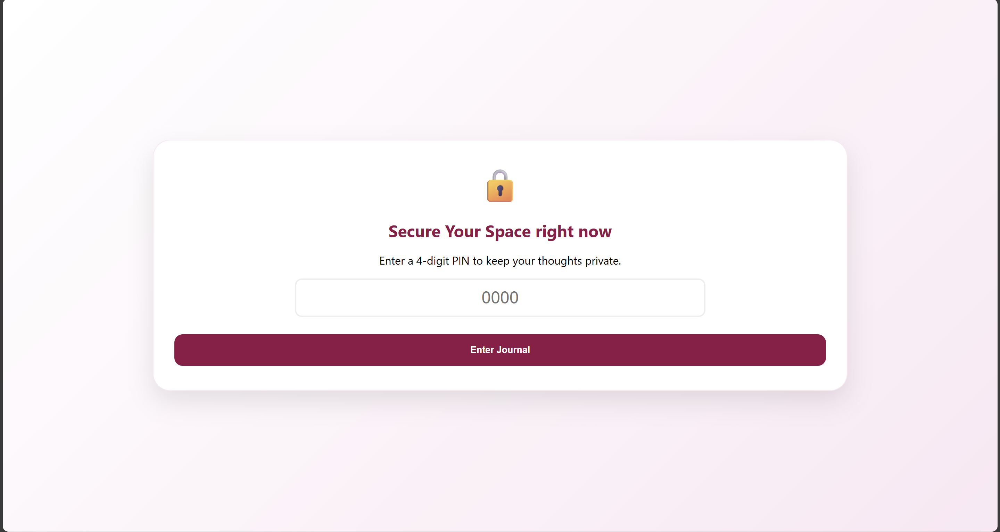
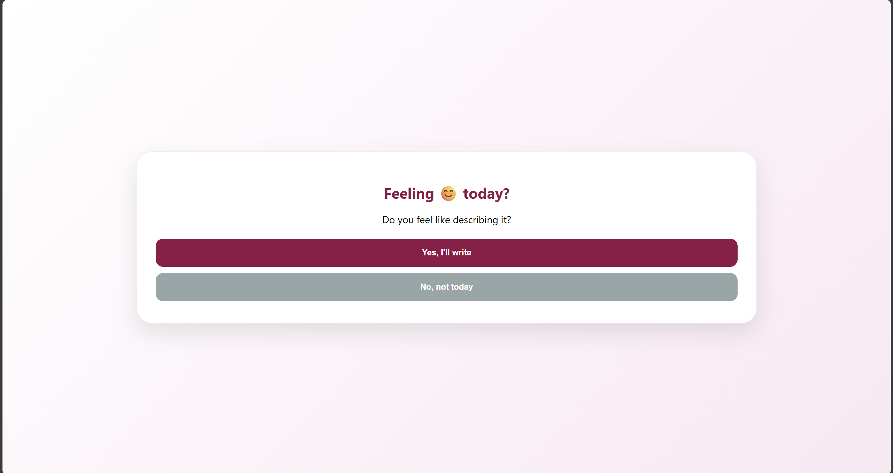
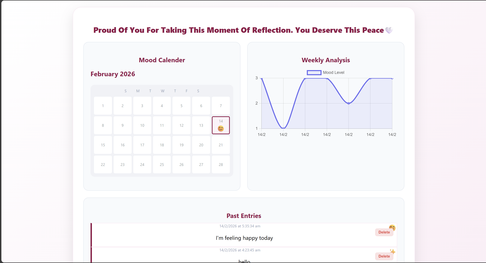

# My Safe Space | Digital Journal 🎯

## Basic Details

### Team Name: Solo Developer

### Team Members

* Member 1: [Ashya] - [Rajiv Gandhi Institute of Technology, Kottayam]

### Hosted Project Link

[https://ashyy-06.github.io/my-safe-space/](https://ashyy-06.github.io/my-safe-space/)

### Project Description

A secure, private, and minimalist digital journal designed for daily reflection. It features mood tracking, a visual calendar, and automated emotional reassurance to help users maintain mental well-being without the need for a complex backend.

### The Problem statement

Many people want to journal for mental health but are concerned about privacy or find complex apps overwhelming. Existing solutions often require cloud accounts, risking data leaks, or lack the "human touch" of emotional feedback.

### The Solution

A "Client-Side Only" web application that stores all data locally in the user's browser. It uses a PIN-protected interface, a branching logic system (Yes/No writing flow) to reduce friction on low-energy days, and provides instant, randomized positive affirmations.

---

## Technical Details

### Technologies/Components Used

**For Software:**

* **Languages used:** HTML5, CSS3, JavaScript (ES6+)
* **Frameworks used:** None (Vanilla JS for lightweight performance)
* **Libraries used:** [Chart.js](https://www.chartjs.org/) (for mood analysis)
* **Tools used:** VS Code, Git, GitHub Pages

---

## Features

* **PIN Security:** A 4-digit privacy screen that masks entries from local "shoulder surfers."
* **Mood Tracking & Analysis:** Visualizes emotional trends over time using a line graph and an emoji-based calendar.
* **Branching Entry Flow:** Offers a "Quick Log" option for days when users don't have the energy to write long-form text.
* **Data Sovereignty:** A "Download Memories" feature that exports all entries into a `.txt` file for permanent offline storage.
* **Account Management:** Includes features to reset PINs or wipe all data (Delete Account) directly from the browser.

---

## Implementation

### For Software:

#### Installation

```bash
git clone https://github.com/Ashyy-06/my-digital-journal.git
cd my-digital-journal

```

#### Run

Simply open the `index.html` file in any modern web browser or use a Live Server extension in VS Code.

---

## Project Documentation

### For Software:

#### Screenshots




#### Diagrams

**System Architecture:**

*The architecture is strictly "Client-Side." Data flows from the UI to JavaScript logic and is persisted in the Browser's LocalStorage. No external server or database is used, ensuring 100% privacy.*

**Application Workflow:**

*The workflow follows a logical progression: User authentication, emotional check-in, content creation, and finally data visualization on the dashboard.*

---

## Project Demo

### Video

[Link to your Demo Video]
*The video demonstrates the full user journey: setting up a PIN, logging a mood, writing an entry, and viewing the graph.*

---

## AI Tools Used

**Tool Used:** Gemini (Google AI)
**Purpose:** Coding assistant and logic architectural design.

* Generated logic for the calendar grid and Chart.js integration.
* Suggested the branching logic for "Quick Log" entries.

**Percentage of AI-generated code:** Approximately 30%

**Human Contributions:**

* UI/UX design and Dark Pink (#970747) color palette implementation.
* Customizing the reassurance message library.
* Testing data persistence and local storage security.

---

## Team Contributions

* **Ashya**: Design, Frontend development (HTML/CSS), Logic implementation (JavaScript), and Documentation.

---

## License

This project is licensed under the MIT License.

